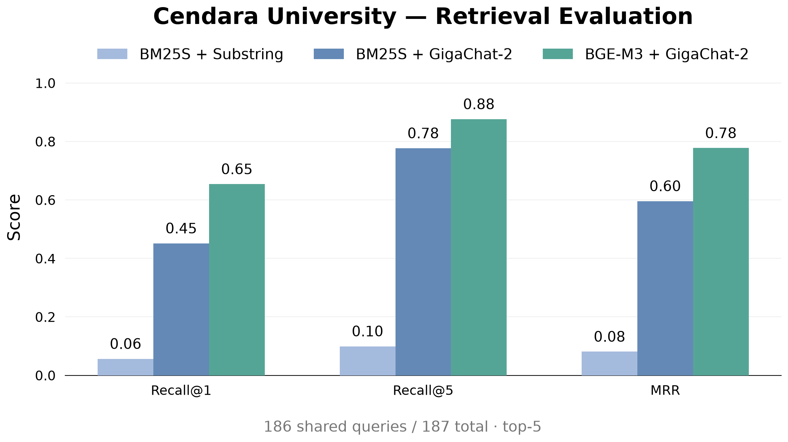

# Cendara University — Retrieval Evaluation

This example demonstrates retrieval evaluation in RAGLab by comparing BM25S and BGE-M3 with GigaChat-2 as an
LLM-as-a-Judge. An additional BM25S baseline uses a simple Substring Judge without LLM calls

## Dataset

We use the Cendara University subset of [RAG-Multi-Corpus](https://github.com/udayallu/RAG-Multi-Corpus).
RAG-Multi-Corpus is a collection of multi-domain question-answering datasets with gold supporting facts. This example is
based on the Cendara University subset, which includes pre-generated chunks, benchmark questions, and supporting facts.
The dataset already includes prepared chunks, benchmark questions and gold supporting facts, so no additional chunking
or manual annotation is required

The experiment uses 397 chunks, 187 questions and top-5 retrieval.

## Example structure

- `prepare.py` — prepares Cendara chunks and benchmark data
- `build_indexes.py` — builds BM25S and BGE-M3 indexes
- `cendara_*.yaml` — retriever, Judge and metric configurations
- `evaluate_substring.py` — evaluates saved BM25S results using substring matching
- `compare.py` — calculates paired metrics from completed experiments
- `plot_results.py` — generates the comparison chart
- `data/` — prepared chunks, benchmark and downloaded source data
- `artifacts/indexes/` — retrieval indexes
- `artifacts/experiments/` — evaluation reports, comparison and visualization

## Running the example

All commands below are executed from `raglab/example/`.

### 1. Install dependencies

```bash
python -m pip install -e '..[example]'
```

### 2. Prepare the dataset

The prepared `chunks.json` and `benchmark.json` are included with this example. To recreate them from the original
dataset:

```bash
mkdir -p data/upstream

git clone https://github.com/udayallu/RAG-Multi-Corpus.git \
    data/upstream/RAG-Multi-Corpus

python prepare.py
```

### 3. Configure the LLM

Copy the environment template:

```bash
cp .env.example .env
```

Add your GigaChat authorization key to `.env`:

```dotenv
GIGACHAT_AUTH_KEY=your_authorization_key
```

This experiment uses GigaChat-2, but RAGLab is not tied to a particular LLM. Another provider can be used by changing
the model configuration and, if necessary, registering its implementation in `composition/chat_models.py`

### 4. Build the indexes

The script builds two indexes from the same Cendara chunks: a lexical BM25S index and a vector index using BGE-M3
embeddings and Chroma. Both are stored in `artifacts/indexes/` and can be reused for subsequent evaluation runs.

Skip this step if the prebuilt indexes are already available.

```bash
python build_indexes.py
```

### 5. Run the evaluation

```bash
raglab evaluate -c cendara_bm25.yaml --project-root .

raglab evaluate -c cendara_bge_m3.yaml --project-root .
```

RAGLab saves a checkpoint after each query. An interrupted experiment can be resumed by running the same command again

To retry queries that failed Judge validation, add `--retry-failed`

### 6. Evaluate the substring baseline

```bash
python evaluate_substring.py
```

This script reuses saved BM25S retrieval results and evaluates all 187 queries locally, without additional retrieval or
LLM calls.

### 7. Compare and visualize

```bash
python compare.py
python plot_results.py
```

The scripts generate the paired comparison and the chart in `artifacts/experiments/`.

## Results

GigaChat-2 successfully evaluated the same 186 out of 187 benchmark questions for both retrievers

| Metric   | BM25S + Substring | BM25S + GigaChat-2 | BGE-M3 + GigaChat-2 |
|----------|------------------:|-------------------:|--------------------:|
| Recall@1 |              0.06 |               0.45 |                0.65 |
| Recall@5 |              0.10 |               0.78 |                0.88 |
| MRR      |              0.08 |               0.60 |                0.78 |

BGE-M3 achieved higher retrieval scores than BM25S across all three metrics when evaluated with GigaChat-2

The Substring Judge produced substantially lower scores because it requires textual matches and cannot reliably
recognize paraphrased or semantically equivalent facts

### Visualization



The chart compares all three evaluation variants on the same 186-query subset

## Known limitation: LLM-as-a-Judge

GigaChat-2 occasionally returned invalid supporting fact indices, even when the correct chunk was retrieved

For example, for the question *"Is Cendara University closed on Martin Luther King Jr. Day in 2025?"*, both retrievers
returned the relevant academic calendar chunk at rank 1. However, GigaChat sometimes returned `(0, 4)` instead of
`(0, 0)`, although the benchmark contained only one supporting fact

RAGLab validates the returned indices and retries invalid responses with corrective feedback. If all attempts fail, the
query is marked as `judge_failed` and excluded from metric aggregation rather than treated as an unsuccessful retrieval

The issue persisted intermittently even after strengthening the prompt. Possible future improvements include structured
output, evaluating supporting facts individually and validating Judge predictions against manually annotated examples

Query index `116` was excluded from the published paired comparison because Judge validation failed for both retrievers

## Experiment artifacts

The `artifacts/experiments/` directory contains the detailed BM25S and BGE-M3 evaluation reports, substring baseline
results, paired comparison JSON and generated chart. These files make it possible to inspect the results without
repeating the LLM evaluation.
